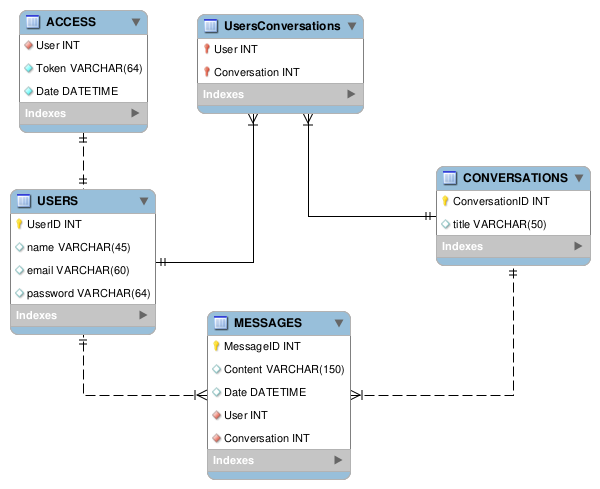

# Matrix Messager Back-end

C'est un projet du cours PROGRAMMATION WEB.

L'objectif est de créer une application Web avec certains prérequis, sans utiliser de frameworks modernes.

Cette page est pour le Côté Serveur.

## Côté Client

[Github - MatrixMessager](https://github.com/brunosantanaa/MatrixMessager)

## Base de données

## Exigences du projet

### Projet de session

Créer une application de votre choix en suivant les exigences suivantes :
- Vous allez créer un site avec un minimum de 4 pages.
- Vous devez faire en sorte qui est un lien entre chacune des pages.
- Dans 2 de ces pages vous devez avoir un formulaire tel que d’enregistrement et/ou de
connexion.
- Pour chaque champ de votre formulaire vous devez avoir au moins 2 exigences et ses exigences
de vont être validés afin que l'utilisateur puisse aller à une nouvelle page.
- Pour tous les formulaires vous devez avoir 2 types de validation :
côté client javascript.
côté serveur PHP.
- Pour l'apparence de votre site ne convient qu'à vous mais faites en sorte d'utiliser le plus de CSS
que possible afin de le rendre attrayant.
- Vous devez créer une base de données dans laquelle vous aurez un minimum de 4 tables Et dans
chacune de ses tables vous devez enregistrer et accéder des données à partir de votre de votre
application web.

Les langages a utilisé dans ce projet sont PHP javascript HTML CSS SQL.